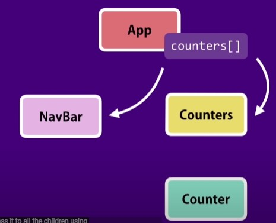

# [Porps](https://reactjs.org/docs/components-and-props.html)

- every react component has a property called props and
- “Props” is a special keyword in React, which stands for properties and is being used for passing data from one component to another.
- But the important part here is that data with props are being passed in a uni-directional flow. (one way from parent to child)
- Furthermore, props data is read-only, which means that data coming from the parent should not be changed by child components.

- [passing children](https://reactjs.org/docs/composition-vs-inheritance.html)

## [Props VS State](https://www.javatpoint.com/react-state-vs-props)

- props is a data that we give to a component
- state is includes data that is local or private to that component , so other components cant access that state , that is completely internal to that component
- porps is read only

## raise event

\*THE COMPONENT THAT OWNS A PIECE OF STATE THAT COMPONENT SHOULD BE THE ONE MODIFING IT

- we can modify a component to reaise an event , so our components can rais events and 'onDelete' => this is the naming convention of events

  
  summary : -> one component wil raise event and other component will handletheevent .this concept of raising and handling events will be seen in a lot of libreries of building ui's

  How to implement this concept react=> basically we are need to add new method in counters component And pass by reference to Tat method via prop to Counter component

  so here the counter component is raising an avent and the counters component is handling the event.
  [check me out for the changes](https://github.com/mikan-senpai/react-tut/commit/8ad6716325af8bfd96f4678ad1260f3edb17832f)

## updating the state

React we do not update the state directly in other words We are not going to remove the particular counter from this state array counter ,Instead we can create a new array without the given counter id and Call the setstate method of our component And let react update the state by wearing the virtual Dom which we just created and physical town which is the existing older Dom

## Single Source Of Truth and Removing local state


- you remove local state and rely on props that the component needs, you refer to this kind of component as a controlled component,
- a controlled component does not have its own local state it receives all the data via props and raises events whenever data needs to be changed
- so this component it entirely controlled by its parent
  

  # Multiple components in sync

  

### earlier


- we pass have the state in counters component and we pass it to counter via props
- Now when did we pass the state of the counters component to the counter component by a process this is because we have a parent-child relationship between these component
- but as we see there is no parent- child relationship between counters component and the navbar component so how can we display the total number of counters in our navigation bar
- well in this situation that this when there is no parent child relationship between two components and you want to keep them in sync you want to share data between then you need to lift the state up
- so in this case we want to lift the state of the counters component to its parent that is app component
- now both to the counters and the navbar component have the same parent .so we can pass data to all the children using props
- and the state actually reside in the app component so we can pass props to both its children that is the navbar and the counters component

  

## lifting state up

- If you want to use state in React Function Component you need hooks. Your component will look something like this when using hooks:

```javascript
import React, { useState } from "react"; // import useState too
import logo from "./logo.svg";
import Counters from "./components/counters";
import Navbar from "./components/navbar";
import "./App.css";

function App() {
  // useState function returns an array with two items. First is your state object (similar to `this.state`)
  // and second is a function to update the state object, ie. the first item of array (similar to `this.setState`, but with minor changes, see react docs for more info, linked above)
  const [counters, setCounters] = useState([
    // useState to set initial counter value
    { id: 1, value: 4 },
    { id: 2, value: 0 },
    { id: 3, value: 0 },
    { id: 4, value: 0 },
  ]);

  // use setCounters method to update the counters state
  const handleDelete = (counterId) =>
    setCounters((counters) => counters.filter((c) => c.id !== counterId));

  const handleReset = () =>
    setCounters((counters) =>
      counters.map((c) => {
        c.value = 0;
        return c;
      })
    );

  const incrementHandle = (counter) => {
    const counters_copy = [...counters]; // rename to counters_copy to avoid having global and local counters variable name conflict
    const index = counters_copy.indexOf(counter);
    counters_copy[index] = { ...counter };
    counter_copy[index].value++;
    setCounters({ counters_copy });
  };

  return (
    <React.Fragment>
      <Navbar />
      <main className="container">
        <Counters
          counters={counters} // no need of this.state
          onIncrement={incrementHandle} // no need to this
          onDelete={handleDelete} // no need to this
          onReset={handleReset} // no need to this
        />
      </main>
    </React.Fragment>
  );
}

export default App;
```

- Or use can use a class component instead of function and use state old way(without hooks).

```javascript
// imports stays the same
...

class App extends React.Component {  // convert to class
constructor(props){
  super(props);
  this.state = {  // initial state in constructor
    counters: [
      { id: 1, value: 4 },
      { id: 2, value: 0 },
      { id: 3, value: 0 },
      { id: 4, value: 0 }
    ]
  };

  ...
  // handler functions stays the same

  render(){  // return goes inside render function
    return (...);  // contents of return stays the same
  }
}

export default App;
// don't actually write ... , it just means what you had in your question the code stays same
```

- Hooks can't be used in class components and this.state can't be used in function component.
  So if your component is:
  function -> use hooks, i.e. useState, useRef etc.
  class -> use this.state and this.setState

- Also function components has better performance and code minification, so I recommend using that. Your app will perform better and will have smaller bundle size.

took reference from [here](https://stackoverflow.com/questions/56609332/state-is-not-defined-no-undef-in-app-js-file)
have a quick read -> [HOOKS](https://reactjs.org/docs/hooks-intro.html)

# Stateless functional Components

[click me](https://code.tutsplus.com/tutorials/stateful-vs-stateless-functional-components-in-react--cms-29541)

- Now a component have a single method that is the render method and we don't have any event handlers are helper methods to calculate values or any calculation ,we only have the render method And also we don't have any state and all the data we are getting is via props

```javascript
import React, { Component } from "react";

class Navbar extends Component {
  render() {
    return (
      <nav className="navbar navbar-light bg-light">
        <a className="navbar-brand" href="#">
          Navbar
          <span className="badge badge-pill badge-secondary m-5">
            {this.props.tolalCounts}
          </span>
        </a>
      </nav>
    );
  }
}

export default Navbar;
```

- in situation like this we can convert this component into what we call a stateless functional component so instead of using a class to define this component , we can use a function let me show you how you can do this
- in stateless functional component the reference “this.props” is only valid in class components In functional components unit and props as a parameter here.And can remove “this” pointer. react ill pass an argument to this navbar function at runtime

```javascript
const Navbar = (props) => {
  return (
    <nav className="navbar navbar-light bg-light">
      <a className="navbar-brand" href="#">
        Navbar{" "}
        <span className="badge badge-pill badge-secondary m-5">
          {props.tolalCounts}
        </span>
      </a>
    </nav>
  );
};
```

# [Destucturing arguments](https://www.geeksforgeeks.org/destructuring-of-props-in-reactjs/)

- What is Destructuring? => Destructuring is a characteristic of JavaScript, It is used to take out sections of data from an array or objects, We can assign them to new own variables created by the developer.
- Here in our navbar component we have a single reference to the props object sometimesWhen working with the more Complex marker we have multiple reference to props. So we might not want to repeat “ this.props “ several times and for that the code gets messy.
  So to reduce that we use object destructuring to destructure the props argument

### syntax

```javascript
const example = ({ requiredprop }) => {
  return <div>{requiredprop}</div>;
};
```

How to use Destructuring? We can use the Destructuring in the following method in ReactJS:

1. Using this.props method

- There are many times when the value extracted during Destructuring no more exist, then in this condition we can use of default behavior of Destructuring, in this, apply a default value

### without destructure

```javascript
const Navbar = (props) => {
  return (
    <nav className="navbar navbar-light bg-light">
      <a className="navbar-brand" href="#">
        Navbar{" "}
        <span className="badge badge-pill badge-secondary m-5">
          {props.tolalCounts}
        </span>
      </a>
    </nav>
  );
};
```

### with destructure

```javascript
const Navbar = ({ tolalCounts }) => {
  return (
    <nav className="navbar navbar-light bg-light">
      <a className="navbar-brand" href="#">
        Navbar{" "}
        <span className="badge badge-pill badge-secondary m-5">
          {tolalCounts}
        </span>
      </a>
    </nav>
  );
};
```

2. Using the Extraction method

to the newly declared properties of Destructuring
In the following code, the activeObject will be set true if it is undefined in this.props.

```javascript
Const {active, activeStatus, activeObject = true } = this.props

```

this is the live example from the project->

### without destructure

```javascript
class Counters06 extends Component {
  render() {
    return (
      <div>
        <button
          className="btn btn-primary btn-sm m-2"
          onClick={this.props.onReset}
        >
          Reset
        </button>
        {this.props.counters.map((counter) => (
          <Counter
            key={counter.id}
            onIncrement={this.props.onIncrement}
            onDelete={this.props.onDelete}
            counter={counter}
          ></Counter>
        ))}
      </div>
    );
  }
}
```

### with destructure

```javascript
class Counters06 extends Component {
  render() {
    const { counters, onReset, onIncrement, onDelete } = this.props;
    return (
      <div>
        <button className="btn btn-primary btn-sm m-2" onClick={onReset}>
          Reset
        </button>
        {counters.map((counter) => (
          <Counter
            key={counter.id}
            onIncrement={onIncrement}
            onDelete={onDelete}
            // value={counter.value}
            // id={counter.id}
            counter={counter}
          ></Counter>
        ))}
      </div>
    );
  }
}
```

- A variable name that is not a copy of the property being destructured may be used. This is achieved by reassigning as shown below.
  In the following code, the properties active, activeStatus have been destructured and reassigned as variables named generating, objectMessage.

```javascript
const { active: generating, activeStatus: objectMessage } = this.props;
```

## Lifecycle Hooks

- Our componentgo through a few faces during their life cycle the first phase is called the mounting fees and this is when and instance of the component is created and inserted into the dom , there are a few special method that we can add to our component and react will automatically call this methods we will refer to these methods as lifecycle hooks .
- So they allow us to hook into certain moments in the life cycle of a component and do something
- the MOUNT phase we have we have three lifecycle hooks

1. Constructor
2. Render
3. componentDidMount

- The 2nd lifecycle phase is the UPDATE phase , and his happens when a state ot the props of a component get changed in this phase we have two lifecycle hooks

1. render
2. componentDidUpdate

So when ever we change the state of a component or give it new props these two above methods are called in order.

- And the last phase is the ONMOUNT phase
  This is when a component is removed from the dom such as when we delete a counter and call the function ->

1. componentWillUnmount

   -> These lifecylce hooks are the frequently used ones

# Getting Started with Create React App

This project was bootstrapped with [Create React App](https://github.com/facebook/create-react-app).

## Available Scripts

In the project directory, you can run:

### `npm start`

Runs the app in the development mode.\
Open [http://localhost:3000](http://localhost:3000) to view it in your browser.

The page will reload when you make changes.\
You may also see any lint errors in the console.

### `npm test`

Launches the test runner in the interactive watch mode.\
See the section about [running tests](https://facebook.github.io/create-react-app/docs/running-tests) for more information.

### `npm run build`

Builds the app for production to the `build` folder.\
It correctly bundles React in production mode and optimizes the build for the best performance.

The build is minified and the filenames include the hashes.\
Your app is ready to be deployed!

See the section about [deployment](https://facebook.github.io/create-react-app/docs/deployment) for more information.

### `npm run eject`

**Note: this is a one-way operation. Once you `eject`, you can't go back!**

If you aren't satisfied with the build tool and configuration choices, you can `eject` at any time. This command will remove the single build dependency from your project.

Instead, it will copy all the configuration files and the transitive dependencies (webpack, Babel, ESLint, etc) right into your project so you have full control over them. All of the commands except `eject` will still work, but they will point to the copied scripts so you can tweak them. At this point you're on your own.

You don't have to ever use `eject`. The curated feature set is suitable for small and middle deployments, and you shouldn't feel obligated to use this feature. However we understand that this tool wouldn't be useful if you couldn't customize it when you are ready for it.

## Learn More

You can learn more in the [Create React App documentation](https://facebook.github.io/create-react-app/docs/getting-started).

To learn React, check out the [React documentation](https://reactjs.org/).

### Code Splitting

This section has moved here: [https://facebook.github.io/create-react-app/docs/code-splitting](https://facebook.github.io/create-react-app/docs/code-splitting)

### Analyzing the Bundle Size

This section has moved here: [https://facebook.github.io/create-react-app/docs/analyzing-the-bundle-size](https://facebook.github.io/create-react-app/docs/analyzing-the-bundle-size)

### Making a Progressive Web App

This section has moved here: [https://facebook.github.io/create-react-app/docs/making-a-progressive-web-app](https://facebook.github.io/create-react-app/docs/making-a-progressive-web-app)

### Advanced Configuration

This section has moved here: [https://facebook.github.io/create-react-app/docs/advanced-configuration](https://facebook.github.io/create-react-app/docs/advanced-configuration)

### Deployment

This section has moved here: [https://facebook.github.io/create-react-app/docs/deployment](https://facebook.github.io/create-react-app/docs/deployment)

### `npm run build` fails to minify

This section has moved here: [https://facebook.github.io/create-react-app/docs/troubleshooting#npm-run-build-fails-to-minify](https://facebook.github.io/create-react-app/docs/troubleshooting#npm-run-build-fails-to-minify)
