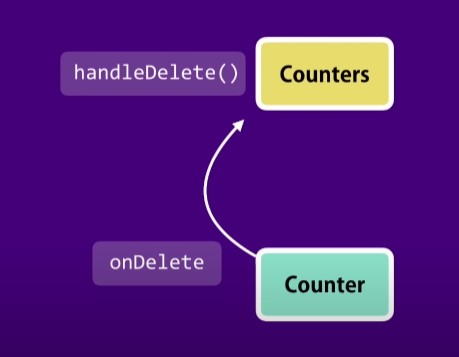

# [Porps](https://reactjs.org/docs/components-and-props.html)

- every react component has a property called props and
- “Props” is a special keyword in React, which stands for properties and is being used for passing data from one component to another.
- But the important part here is that data with props are being passed in a uni-directional flow. (one way from parent to child)
- Furthermore, props data is read-only, which means that data coming from the parent should not be changed by child components.

## [passing children](https://reactjs.org/docs/composition-vs-inheritance.html)

## Props VS State

- props is a data that we give to a component
- state is includes data that is local or private to that component , so other components cant access that state , that is completely internal to that component
- porps is read only

## raise event

\*THE COMPONENT THAT OWNS A PIECE OF THE STATE SHOULD BE THE ONE MODIFING IT

- we can modify a component to reaise an event , so our components can rais events and 'onDelete' => this is the naming convention of events

  
  summary : -> one component wil raise event and other component will handletheevent .this concept of raising and handling events will be seen in a lot of libreries of building ui's

  How to implement this concept react=> basically we are need to add new method in counters component And pass by reference to Tat method via prop to Counter component

  so here the counter component is raising an avent and the counters component is handling the event.
  [check me out for the changes](https://github.com/mikan-senpai/react-tut/commit/8ad6716325af8bfd96f4678ad1260f3edb17832f)

## updating the state

React we do not update the state directly in other words We are not going to remove the particular counter from this state array counter ,Instead we can create a new array without the given counter id and Call the setstate method of our component And let react update the state by wearing the virtual Dom which we just created and physical town which is the existing older Dom

## Single Source Of Truth and Removing local state

- you remove local state and rely on props that the component needs, you refer to this kind of component as a controlled component,
- a controlled component does not have its own local state it receives all the data via props and raises events whenever data needs to be changed
- so this component it entirely controlled by its parent
  

  # Multiple components in sync

  

### earlier

- we pass have the state in counters component and we pass it to counter via props
- Now when did we pass the state of the counters component to the counter component by a process this is because we have a parent-child relationship between these component
- but as we see there is no parent- child relationship between counters component and the navbar component so how can we display the total number of counters in our navigation bar
- well in this situation that this when there is no parent child relationship between two components and you want to keep them in sync you want to share data between then you need to lift the state up
- so in this case we want to lift the state of the counters component to its parent that is app component
- now both to the counters and the navbar component have the same parent .so we can pass data to all the children using props
- and the state actually reside in the app component so we can pass props to both its children that is the navbar and the counters component

  

# Getting Started with Create React App

This project was bootstrapped with [Create React App](https://github.com/facebook/create-react-app).

## Available Scripts

In the project directory, you can run:

### `npm start`

Runs the app in the development mode.\
Open [http://localhost:3000](http://localhost:3000) to view it in your browser.

The page will reload when you make changes.\
You may also see any lint errors in the console.

### `npm test`

Launches the test runner in the interactive watch mode.\
See the section about [running tests](https://facebook.github.io/create-react-app/docs/running-tests) for more information.

### `npm run build`

Builds the app for production to the `build` folder.\
It correctly bundles React in production mode and optimizes the build for the best performance.

The build is minified and the filenames include the hashes.\
Your app is ready to be deployed!

See the section about [deployment](https://facebook.github.io/create-react-app/docs/deployment) for more information.

### `npm run eject`

**Note: this is a one-way operation. Once you `eject`, you can't go back!**

If you aren't satisfied with the build tool and configuration choices, you can `eject` at any time. This command will remove the single build dependency from your project.

Instead, it will copy all the configuration files and the transitive dependencies (webpack, Babel, ESLint, etc) right into your project so you have full control over them. All of the commands except `eject` will still work, but they will point to the copied scripts so you can tweak them. At this point you're on your own.

You don't have to ever use `eject`. The curated feature set is suitable for small and middle deployments, and you shouldn't feel obligated to use this feature. However we understand that this tool wouldn't be useful if you couldn't customize it when you are ready for it.

## Learn More

You can learn more in the [Create React App documentation](https://facebook.github.io/create-react-app/docs/getting-started).

To learn React, check out the [React documentation](https://reactjs.org/).

### Code Splitting

This section has moved here: [https://facebook.github.io/create-react-app/docs/code-splitting](https://facebook.github.io/create-react-app/docs/code-splitting)

### Analyzing the Bundle Size

This section has moved here: [https://facebook.github.io/create-react-app/docs/analyzing-the-bundle-size](https://facebook.github.io/create-react-app/docs/analyzing-the-bundle-size)

### Making a Progressive Web App

This section has moved here: [https://facebook.github.io/create-react-app/docs/making-a-progressive-web-app](https://facebook.github.io/create-react-app/docs/making-a-progressive-web-app)

### Advanced Configuration

This section has moved here: [https://facebook.github.io/create-react-app/docs/advanced-configuration](https://facebook.github.io/create-react-app/docs/advanced-configuration)

### Deployment

This section has moved here: [https://facebook.github.io/create-react-app/docs/deployment](https://facebook.github.io/create-react-app/docs/deployment)

### `npm run build` fails to minify

This section has moved here: [https://facebook.github.io/create-react-app/docs/troubleshooting#npm-run-build-fails-to-minify](https://facebook.github.io/create-react-app/docs/troubleshooting#npm-run-build-fails-to-minify)
